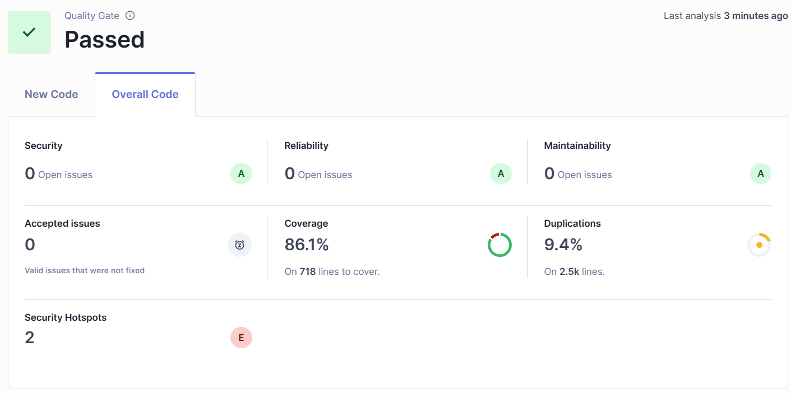

# 🍽️ Touta Cooking – Fullstack App (Spring Boot + React)

This is the fullstack implementation of the **Touta Cooking** challenge developed by **Olivier Touta** for a technical consulting role.

This project aims to showcase my best effort in applying modern technologies and good practices across both backend and frontend development.

---

## 📁 Project Structure

- `src/main/java`: Java source code (Spring Boot backend)
- `src/main/resources`: Spring configuration files + p12 certificate for localhost
- `src/test/java`: Unit tests and light integration tests for coverage
- `src/test/resources`: Test-specific configuration
- `src/react`: React client app and its certificates
- `db_scripts`: SQL scripts to initialize the PostgreSQL database

---

## 📊 Requirements

- **Java 17 or later**
- **Maven 3.8.1+** (Recommended: 3.8.8 or 3.9.x)
- **Node.js + npm**
- **PostgreSQL** installed and running
- (Optional) **Fake SMTP server** for email testing

---

## 🧱 Preparation and Database Creation

### 1. Clone the Repository

```bash
git clone https://github.com/your-account/touta-cooking.git
cd touta-cooking
```

### 2. Configure `application.properties`

Update `src/main/resources/application.properties` with your own properties:

```properties
spring.datasource.url=jdbc:postgresql://localhost:5432/toutacooking
spring.datasource.username=yourusername
spring.datasource.password=yourpassword

spring.jpa.hibernate.ddl-auto=update
spring.mail.host=smtp.example.com
spring.mail.port=587
spring.mail.username=email@example.com
spring.mail.password=your-email-password

# JWT
touta-cooking.jwtSecret=YOUR_ENCODED_SECRET
touta-cooking.jwtExpirationMs=86400000
```

### 3. Initialize the Database

As the `postgres` user, run the SQL script after updating the username and password values within it :

```bash
psql -U postgres -f db_scripts/Create_Database.sql
```

---

## 🏗️ Backend Build

### 1. Package the Backend

```bash
mvn clean install
```

### 2. Run the Backend

With Maven installed globally:

```bash
mvn spring-boot:run
```

---

## 🎨 Frontend Setup (React)

### 1. Navigate to React Source

```bash
cd src/react/touta_cooking_website
```

### 2. Install Dependencies (all in one go)

```bash
npm install bootstrap react-cookie react-router-dom reactstrap react-hook-form axios validator
```

Verify installed packages:

```bash
npm list --depth=0
```

### 3. Build the App

```bash
npm run build
```

### 4. Launch the App (development server)

```bash
npm start
```

> The app will be available at: `https://localhost:8081`

---

## ✅ Testing

Run the tests:

```bash
mvn test
```

A Jacoco coverage report is generated at `target/site/jacoco/index.html`.

---

## 📈 Sonar Analysis

Make sure SonarQube is running locally. If required, update your `.m2/settings.xml` with your token.

Run the following command to perform static code analysis with SonarQube:

```bash
mvn clean verify sonar:sonar \
  -Dsonar.projectKey=touta_cooking_website \
  -Dsonar.host.url=http://localhost:9000
```

Once the scan is complete, you can view the results in the SonarQube dashboard. Below is a summary of the latest analysis:

- **Security**: A (0 open issues)
- **Reliability**: A (0 open issues)
- **Maintainability**: A (0 open issues)
- **Coverage**: 86.1% (on 718 lines)
- **Duplications**: 9.4% (on 2.5k lines)
- **Security Hotspots**: 2 (E)

<p align="center">
  
</p>

> ℹ️ For more details, visit the SonarQube UI at [http://localhost:9000](http://localhost:9000) or check the `target/sonar` folder generated by the build.

---

## 🌐 Available API Endpoints
### 👥 Everyone
- `POST /api/auth/signin`: Login
- `POST /api/auth/signup`: Register

### 🛠️ Administrator
- `GET /api/users/users`: View all users
- `GET /api/users/user/{id}`: View one user
- `POST /api/users/user`: Create a user
- `PUT /api/users/user/{id}`: Update a user
- `DELETE /api/users/user/{id}`: Delete a user

### 👨‍🍳 Chef
- `GET /api/chef/myrecipes`: View my recipes
- `GET /api/chef/recipe/{id}`: View one of my recipes
- `POST /api/chef/recipe`: Create a recipe
- `PUT /api/chef/recipe/{id}`: Update a recipe
- `DELETE /api/chef/recipe/{id}`: Delete a recipe

### 🙋 User
- `GET /api/recipes/all`: View all recipes
- `GET /api/recipes/recipe/{id}`: View a specific recipe
- `POST /api/recipes/comment`: Comment on a recipe

---

## 🏗️ Architecture & Technology Stack

- **Frontend**: React, Bootstrap, React Router
- **Backend**: Java, Spring Boot 3.4.4, JPA, JWT, Spring Security
- **Database**: PostgreSQL (with H2 for testing)
- **Build & Quality Tools**: Maven, Jacoco, SonarQube

---

## 🎯 Design Decisions & Rationale

- **RESTful API**: Clear separation between client and server for scalability.
- **Spring Boot**: Rapid development with a wide ecosystem.
- **JWT Security**: Stateless authentication for performance and ease of integration.
- **Modular Structure**: Separation of concerns between backend and frontend.
- **Quality Focus**: Extensive tests with Jacoco coverage and regular SonarQube analysis.

---

## ⚠️ Known Issues & Limitations

- Currently, some endpoints are not fully secured with role-based restrictions. Future improvements will enforce stricter security.
- The duplication and coverage metrics are dependent on the current codebase; further refactoring may improve these metrics.

---

## 🚧 Future Enhancements

- **Real-time notifications** via WebSocket.
- **Enhanced API Documentation** with Swagger/OpenAPI.
- **Dockerization** for easier deployment.
- **CI/CD Pipeline** integration for automated tests, builds and deployments.
- **Improved error handling** and logging mechanisms.

---

## 📞 Contact

For any questions or feedback, please contact **Olivier Touta** at [touta.olivier@gmail.com](mailto:touta.olivier@gmail.com).
